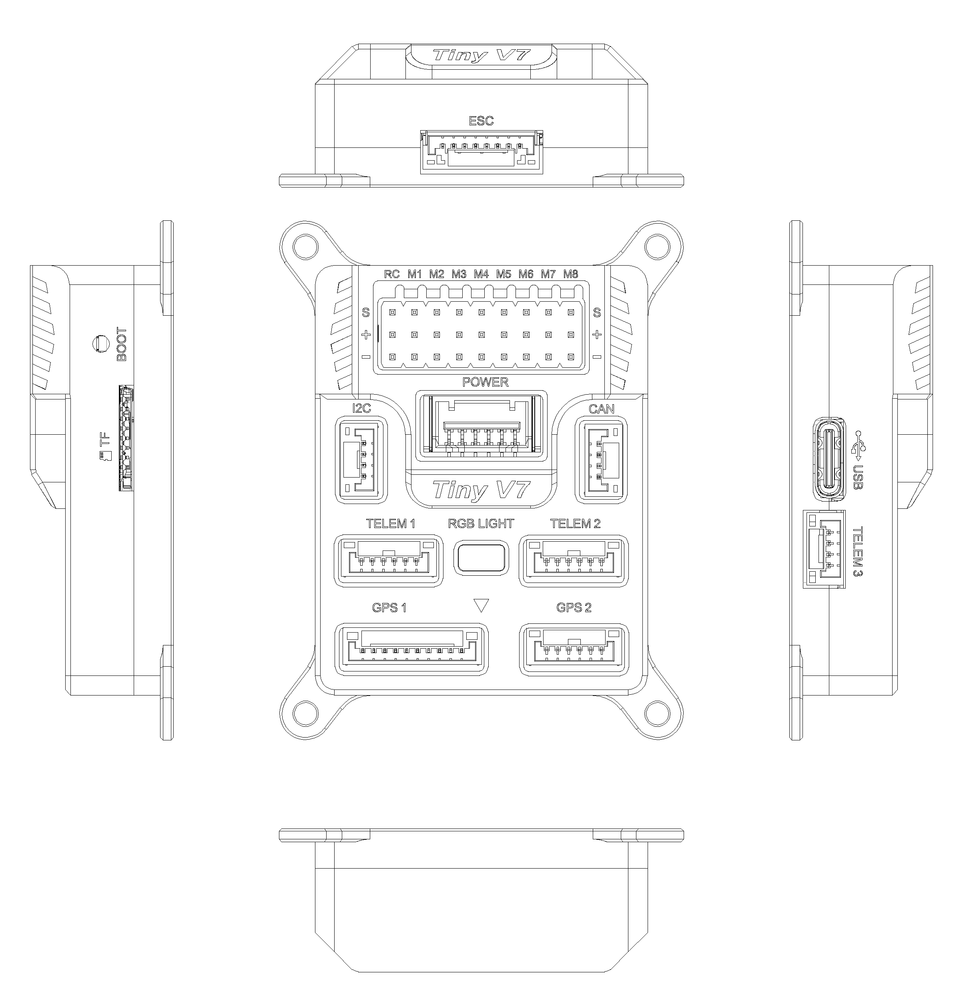
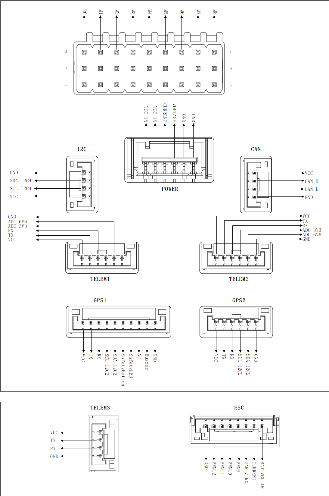

# VUAV-V7Tiny Flight Controller

The VUAV-V7Tiny  flight controller is manufactured and sold by [V-UAV](http://www.v-uav.com/).

## Features

 - STM32H743 microcontroller

 - Two IMUs: ICM45686,BMI088

 - Internal IST8310 magnetometer

 - Internal ICP-20100 barometer

 - Internal RGB LED

 - MicroSD card slot port

 - 1 Analog power port

 - 1 Battery power port

 - 5 UARTs and 1 USB ports

 - 12 PWM output ports

 - 1 I2C and 1CAN ports

 - Safety switch port

 - Buzzer port

 - RC IN port

   

##  Pinout

## UART Mapping
 - SERIAL0 -> USB
 - SERIAL1 -> UART2 (Telem1) (DMA enabled)
 - SERIAL2 -> UART5 (Telem2) (DMA enabled)
 - SERIAL3 -> UART1 (GPS1) (DMA enabled)
 - SERIAL4 -> UART3 (GPS2) (DMA enabled)
 - SERIAL5 -> UART7 (Telem3) (DMA enabled)
 - SERIAL6 -> USB2 (virtual port on same connector)

The Telem1 port has RTS/CTS pins, the other UARTs do not have RTS/CTS.

##  Connectors

### **TELEM1 port**

| Pin  | Signal   | Volt  |
| ---- | -------- | ----- |
| 1    | VCC      | +5V   |
| 2    | TX (OUT) | +3.3V |
| 3    | RX (IN)  | +3.3V |
| 4    | CTS      | +3.3V |
| 5    | RTS      | +3.3V |
| 6    | GND      | GND   |

### **TELEM2  ADC port**

| Pin  | Signal   | Volt  |
| ---- | -------- | ----- |
| 1    | VCC      | +5V   |
| 2    | TX (OUT) | +3.3V |
| 3    | RX (IN)  | +3.3V |
| 4    | ADC_3V3  | +3.3V |
| 5    | ADC_6V6  | +3.3V |
| 6    | GND      | GND   |

### **TELEM3  port**

| Pin  | Signal   | Volt  |
| ---- | -------- | ----- |
| 1    | VCC      | +5V   |
| 2    | TX (OUT) | +3.3V |
| 3    | RX (IN)  | +3.3V |
| 4    | GND      | GND   |

### **GPS1/I2C2 port**

| Pin  | Signal       | Volt            |
| ---- | ------------ | --------------- |
| 1    | VCC          | +5V             |
| 2    | TX (OUT)     | +3.3V           |
| 3    | RX (IN)      | +3.3V           |
| 4    | SCL I2C2     | +3.3V (pullups) |
| 5    | SDA I2C2     | +3.3V (pullups) |
| 6    | SafetyButton | +3.3V           |
| 7    | SafetyLED    | +3.3V           |
| 8    | -            | -               |
| 9    | Buzzer       | +3.3V           |
| 10   | GND          | GND             |

### **GPS2/I2C2 port**

| Pin  | Signal   | Volt            |
| ---- | -------- | --------------- |
| 1    | VCC      | +5V             |
| 2    | TX (OUT) | +3.3V           |
| 3    | RX (IN)  | +3.3V           |
| 4    | SCL I2C2 | +3.3V (pullups) |
| 5    | SDA I2C2 | +3.3V (pullups) |
| 6    | GND      | GND             |

### CAN1 port

| Pin  | Signal | Volt  |
| ---- | ------ | ----- |
| 1    | VCC    | +5V   |
| 2    | CAN_H  | +3.3V |
| 3    | CAN_L  | +3.3V |
| 4    | GND    | GND   |

### I2C port

| Pin  | Signal   | Volt           |
| ---- | -------- | -------------- |
| 1    | VCC      | +5V            |
| 2    | SCL I2C4 | +3.3 (pullups) |
| 3    | SDA_I2C4 | +3.3 (pullups) |
| 4    | GND      | GND            |

### POWER

| Pin  | Signal  | Volt        |
| ---- | ------- | ----------- |
| 1    | VCC IN  | +5V         |
| 2    | VCC IN  | +5V         |
| 3    | CURRENT | up to +3.3V |
| 4    | VOLTAGE | up to +3.3V |
| 5    | GND     | GND         |
| 6    | GND     | GND         |

### ESC

| Pin  | Signal     | Volt        |
| ---- | ---------- | ----------- |
| 1    | BAT VCC IN | +6V         |
| 2    | CURRENT    | up to +3.3V |
| 3    | UART7_RX   | +3.3V       |
| 4    | PWM9       | +3.3V       |
| 4    | PWM10      | +3.3V       |
| 5    | PWM11      | +3.3V       |
| 67   | PWM12      | +3.3V       |
| 8    | GND        | GND         |

## RC Input

The RC input is configured on the RCIN pin at one end of the servo rail. This pin supports all unidirectional RC protocols. For bidirectional protocols, such as CRSF/ELRS, SERIAL1~5 can be set to protocol "23" and the receiver can be connected to SERIAL1~5.

## PWM Output

The VUAV-V7Tiny  supports up to 12 PWM outputs,support all PWM protocols. Outputs 1-8support  DShot. Outputs 1-8 support bi-directional Dshot. All 12 PWM outputs have GND on the top row, 5V on the middle row and signal on the bottom row.

The 12 PWM outputs are in 4 groups:

 - PWM 1, 2, 3 and 4 in group1
 - PWM 5, 6, 7 and 8 in group2
 - PWM 9, 10 in group3
 - PWM 11, 12in group4

Channels within the same group need to use the same output rate. If any channel in a group uses DShot, then all channels in that group need to use DShot.

## GPIOs

All 12 PWM channels can be used for GPIO functions (relays, buttons, RPM etc).
The pin numbers for these PWM channels in ArduPilot are shown below:

| PWM Channels | Pin  | PWM Channels | Pin  |
| ------------ | ---- | ------------ | ---- |
| PWM1         | 50   | PWM7         | 56   |
| PWM2         | 51   | PWM8         | 57   |
| PWM3         | 52   | PWM9         | 58   |
| PWM4         | 53   | PWM10        | 59   |
| PWM5         | 54   | PWM11        | 60   |
| PWM6         | 55   | PWM12        | 61   |

## Analog inputs

The VUAV-V7Tiny  flight controller has 5 Analog inputs

 - ADC Pin18-> Battery Current

 - ADC Pin4 -> Battery Voltage 

 - ADC Pin19 -> ADC 3V3 Sense

 - ADC Pin5 -> ADC 6V6 Sense

 - ADC Pin10  -> Battery Voltage input on ESC connector

 - ADC Pin8  -> Servo Voltage

   

## Battery Monitor Configuration

The board has voltage and current inputs sensor on the POWER and ESC connector.
The correct battery setting parameters are:

Enable POWER monitor:
 - BATT_MONITOR   4
 - BATT_VOLT_PIN 4
 - BATT_CUR_PIN 8
 - BATT_VOLT_MULT 20
 - BATT_AMP_PERVLT 24

Enable ESC battery monitor (if used) :
 - BATT2_MONITOR  3

 - BATT2_VOLT_PIN 10

 - BATT2_VOLT_MULT 10.09

   

## Loading Firmware

Firmware for these boards can be found at [ArduPilot Firmware Download](https://firmware.ardupilot.org/) in sub-folders labeled “VUAV-TinyV7”.

The board comes pre-installed with an ArduPilot compatible bootloader, allowing the loading of \*.apj firmware files with any ArduPilot compatible ground station.